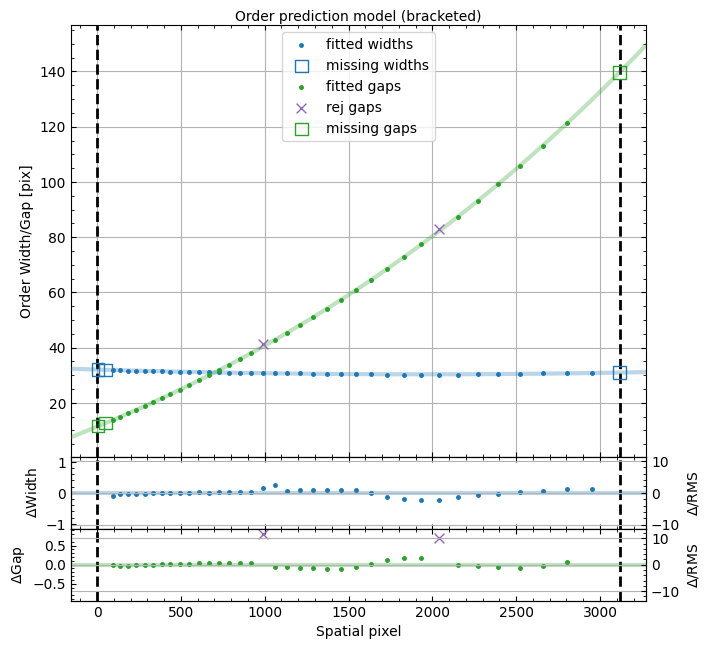

.. TODO: We should expand this page, showing examples of the QA plots and
.. describing them in more detail.

.. _qa:

=========
PypeIt QA
=========

As part of the standard reduction, PypeIt generates a series
of fixed-format Quality Assurance (QA) figures. This document describes
the typical outputs, in the typical order that they appear.

*This page is still a work in progress.*

The basic arrangement is that individual PNG files are created
and then a set of HTML files are generated to organize
viewing of the PNGs.

HTML
====

When the code completes (or crashes out), an HTML file is generated in the
``QA/`` folder, one per setup that has been reduced (typically one).  An example
filename is ``MF_A.html``.  These HTML files are out of date, so you're better
off opening the PNG files in the ``PNGs`` directory directly.

Calibration QA
==============

The first QA PNG files generated are related
to calibration processing.  There is a unique
one generated for each setup and detector and
(possibly) calibration set.

Generally, the title describes the type of QA plotted.

.. _qa-order-predict:

Echelle Order Prediction
------------------------

When reducing echelle observations and inserting missing orders, a QA plot is
produced to assess the success of the predicted locations.  The example below is
for Keck/HIRES.

   Example QA plot showing the measured order spatial widths (blue) and gaps
   (green) in pixels.  The widths should be nearly constant as a function of
   position, whereas the gaps should change monotonically with spatial pixel.

In the figure above, measured values that are included in the polynomial fit are
shown as filled points.  The colored lines show the best fit polynomial model
used for the predicted order locations.  The fit allows for an iterative
rejection of points; measured widths and gaps that are rejected during the fit
are shown as orange and purple crosses, respectively.  The measurements that are
rejected during the fit are not necessarily *removed* as invalid traces, but the
code allows you to identify outlier traces that *will be* removed.  None of the
traces in the example image above are identified as outliers; if they exist,
they will be plotted as orange and purple triangles for widths and gaps,
respectively.  Missing orders that will be added are included as open squares;
gaps are green, widths are blue.  To deal with overlap, "bracketing" orders are
added for the overlap calculation but are removed in the final set of traces;
the title of the plot indicates if bracketing orders are included and the
vertical dashed lines shows the edges of the detector/mosaic.

.. _qa-wave-fit:

Wavelength Fit QA
-----------------

PypeIt produces plots like the one below showing the result of the wavelength
calibration.

.. figure:: figures/deimos_arc1d.png
   :width: 60%

   An example QA plot for Keck/DEIMOS wavelength calibration.  The extracted arc
   spectrum is shown to the left with arc lines used for the wavelength solution
   marked in green.  The upper-right plot shows the best-fit calibration between
   pixel number and wavelength, and the bottom-right plot shows the residuals as
   a function of pixel number.

See :doc:`calibrations/wvcalib` for more discussion of this QA.

.. _qa-wave-tilt:

Wavelength Tilts QA
-------------------

PypeIt produces plots like the one below showing the result of tracing the tilts
in the wavelength as a function of spatial position within the slits.

.. figure:: figures/mosfire_arc2d.png
   :width: 60%

   An example QA plot for a single slit in a Keck/MOSFIRE tilt QA plot.  Each
   horizontal line of black dots is an OH line.  Red points were rejected in the
   2D fitting.  Provided most were not rejected, the fit should be good.

See :doc:`calibrations/tilts` for more discussion of this QA.

Exposure QA
===========

For each processed, science exposure there are a series of
PNGs generated, per detector and (sometimes) per slit.

Flexure QA
----------

If a flexure correction was performed (default), the fit to the
correlation lags per object
is shown and the adopted shift is listed.  Here is
an example:

.. figure:: figures/qa/flex_corr_armlsd.jpg
   :align: center

There is then a plot showing several sky lines
for the analysis of a single object (brightest)
from the data compared against an archived sky spectrum.
These should coincide well in wavelength.
Here is an example:

.. figure:: figures/qa/flex_sky_armlsd.jpg
   :align: center

